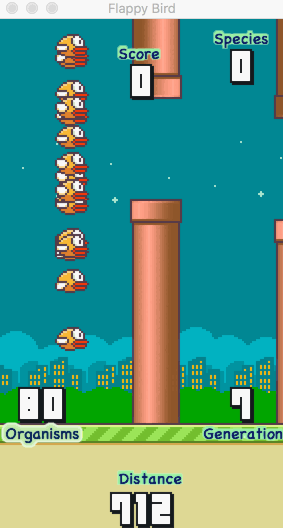

# FlapPyBio-NEAT

Detailed explanation in the works. In short, the Neuroevolution of Augmenting Topologies (NEAT) was fully implemented in Python to solve the Flappy Bird game. The hyper-parameters are in need of optimization, as well as a few aspects of the algorithm pertaining to speciation thresholding and, particularly, crossover during mating / repopulation events.

</img>
